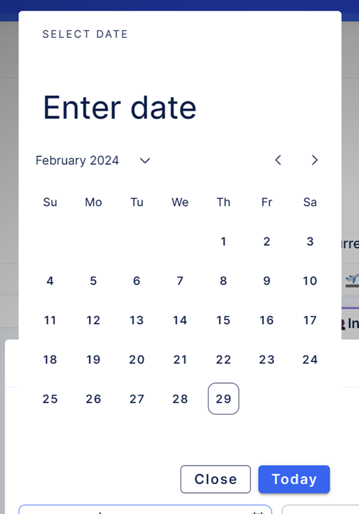
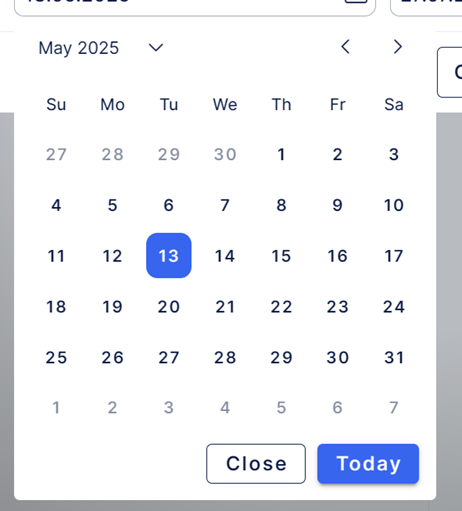

# Vuetify styles

*In this article can be found few tips how to style vuetify component.*

---


## Predefined Vuetify Sass variables

Let’s show a possible problems and tips on implementation of vDatepicker in EasyProject application.

Once `<VDatepicker/>` is implemented, there are visual shortcomings e.g. spaces between day buttons 
are too large increasing element size and activate/current day has black color io. typical EasyProject
blue.<br/>



Obvious solution would be to restyle classes on specific elements. However, this can resolve in 
unexpected outcomes, hence it’s not recommended, and it should be resolved to only as last solution.

If we refer to Vuetify API documentation: [VDatePicker API — Vuetify (vuetifyjs.com)](https://vuetifyjs.com/en/api/v-date-picker)<br/>
we found out, that we can use prepared Sass variables to 
restyle component. Element Sass variables are usually placed at the bottom of specific Vuetify element.

So how do we decrease size of our date picker? 
Judging from name of Sass variable, we can assume that $date-picker-month-day-size and 
$date-picker-width is what we need.

It’s important to consider that Vuetify is rapidly developing (usually with at least 1 
minor version per week). So, what can happen is the style (Sass variable) we want to change isn’t 
in the list.

It doesn’t have to mean necessarily that variable doesn’t exist. You can refer to:
1. Node package inside node_modules:
e.g. in our case it would be:
node_modules/vuetify/lib/components/VDatePicker/_variables.scss
Always refer to .scss file, as .css are their compiled versions.<br/>
Notice !default annotation, which indicates that this value will always be replaced, by value
we define variable value in our project.

```scss
$date-picker-width: 328px !default;
$date-picker-show-week-width: 368px !default;

$date-picker-header-height: 70px !default;

$date-picker-month-btn-height: 24px !default;
$date-picker-month-btn-size: 0.85rem !default;
$date-picker-month-column-gap: 4px !default;
$date-picker-month-day-size: 40px !default;
$date-picker-month-font-size: 0.85rem !default;
$date-picker-month-padding: 0 12px 8px !default;

$date-picker-months-grid-gap: 0px 24px !default;
$date-picker-months-height: 288px !default;

$date-picker-years-height: 288px !default;
$date-picker-years-padding-inline: 32px !default;

```

2. Github Vuetify repository:<br/>
[GitHub - vuetifyjs/vuetify: 🐉 Vue Component Framework](https://github.com/vuetifyjs/vuetify)<br/>
Here you can find here up to date source code of Vuetify. There is chance that missing variable was 
recently added. In that case, Vuetify version can be increased in package.json file.
After changing both variables, 

After changing both variables, we achieved a smaller size of date picker.<br/>

## Predefined Vuetify component props

However there are still some issues with styling. E.g. button of selected day is dark, io. blue and 
there are some parts which are quite obsolete, like header, lets fix it, by referring to vuetify 
documentation, where we can find various props for setting up date picker further. The following 
props (which are quite common to all vuetify components) can be used to fix our problem: **color** and
**hideHeader**. Vuetify has been already configured to inherit our color pallet, so by setting up 
this prop, we can enforce it.

`color=”primary”` will set active day buttons to blue.<br/>
`:hide-header=”true”` will remove header completely.

Our date picker now looks like:<br/>



Note, that we gather possible values for style related props in enum file:
`app/frontend/src/easy-ui/types/index.ts.`

We have achieve that without configuring any .scss files in our app.
