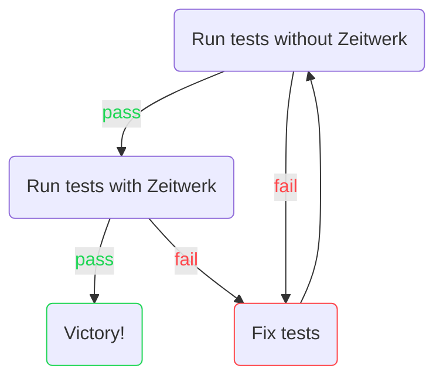

# File structure and Transition

*This guide is all about our transition to enable Zeitwerk in EP/ER. It goes over some details about Zeitwerk and how it
impacts our application. Then outlines steps for making this transition, and ends with some extra info for those who
want to know more context behind individual changes.*

## Zeitwerk

We are gradually switching from the old way of doing things to being able to enable
[Zeitwerk](https://guides.rubyonrails.org/classic_to_zeitwerk_howto.html). That requires a dramatic change in file
structure. It will be a long process and in the meantime we need to ensure backwards compatibility. Below is a guideline
on what the new structure should look like and some steps to help you with making this transition. Version `v13` of
EP/ER will support both old and new structure with Zeitwerk **disabled** and deprecation warnings in place. In `v14` we
plan a hard switch to **enabled** Zeitwerk and will no longer support the old structure.

> To enable Zeitwerk in your local environment set the `ZEITWERK_POWERED` environment variable to `1`.

### Directory structure

The main thing we lack to support Zeitwerk conventions is **proper file naming** (module scoping and one module/class
per file, matching it's name) and thus enabling Zeitwerk _autoloading_. To make it work we decided to gradually refactor
and unify all plugins from `plugins/` and `plugins/easyproject/easy_plugins/` directories in a new `easy_plugins/`
directory. It will be a gradual process. Other notable changes include proper separation of `initializers`, refactoring
of `lib/` and `patches/` directories, old `migrations` timestamping, unified `spec_helper` requiring.

###### Redmine

Redmine already supports Zeitwerk from version `5.0.0` so there are only a few changes outside of our plugins/engines.

###### Plugins

Old plugin directory. Plugins in here will be gradually moved to `easy_plugins/` directory.

###### Easy Plugins

New directory `easy_plugins/` was created and should contain plugins for EasyProject and EasyRedmine.

###### RYSes

**RYSes** keep their current structure, but some transition steps below might be necessary to keep Zeitwerk
compatibility.

### Load order

With these changes we need to again reevaluate and ensure correct load order, mainly concerning patches.

`RedmineExtensions::Reloader.to_prepare` no longer supported. Replace it based on the order you need,
usually:

- `Rails.application.config.to_prepare` - executes first, also, content is **reloaded** in development mode
- `Rails.application.config.before_initialize` - executes before `after_initialize, content is **not reloaded** in
  development mode
- `Rails.application.config.after_initialize` - executes always at the end of initialization process, content is **not
  reloaded** in development mode

### Deprecation warnings

We've added custom deprecation warnings to make it easier to recognize many, but not all, of the pieces of code that
need to be addressed.

### Plugin-to-Easy-Plugin transition steps

> To enable Zeitwerk in your local environment set the `ZEITWERK_POWERED` environment variable to `1`.

If you want to keep backwards compatibility we recommend this approach (always make sure classic works):



Otherwise, you can just focus on making Zeitwerk work.

**Point-by-point (in no particular order) guide to turning a _plugin_ into a Zeitwerk compatible _easy_plugin_.**
<!-- theme: danger -->
> First, to keep **git history** for files moved between directories use:
> - ✅ `git mv`
> - ✅ _drag&drop_
> - ✅ `ctrl + x` into `ctrl + v`
> - ❌ `ctrl + c` into `ctrl + v`

- **App directory**
  - All modules/classes must be properly named
    - Each file needs to contain only a **single module/class matching the file's name**
    - **Module scoping**\
      File inside `easy_plugins/my_cool_plugin/models/pages/first_page.rb` needs to look like:
      ```ruby
      # easy_plugins/my_cool_plugin/models/pages/first_page.rb
      module Pages
        class FirstPage
      
        end
      end
      ```
    - **Exceptions** can be defined in `easy_plugins/my_cool_plugin/lib/my_cool_plugin/engine.rb`\
      This way you can get around module scoping, which we used for these most used models to avoid rewriting
      everything in `easy_extensions`
      ```ruby
      paths["app/models"] << "app/models/api_services_for_exchange_rates"
      paths["app/models"] << "app/models/easy_entity_actions"
      paths["app/models"] << "app/models/easy_page_modules"
      paths["app/models"] << "app/models/easy_queries"
      paths["app/models"] << "app/models/easy_rakes"
      ```
- **Initializers**
  - `easy_extensions` initializers (`easy_engines/easy_extensions/config/initializers/`) have been refactored into
    many smaller files that serve as a template for **where to put each initialization step**
  - Most used initializers and _common fixes_ for them:
    - `01_access_control.rb` - for defining permissions
      - _Common fixes_: wrap content in `Rails.application.config.after_initialize`
      - Example:
        ```ruby
        # easy_plugins/my_cool_plugin/config/initializers/01_access_control.rb
        Rails.application.config.after_initialize do
          Redmine::AccessControl.map do |map|
            map.project_module :my_cool_plugin do |map|
              map.permission :view_my_cool_plugin_entities, { my_cool_plugin_entities: [:index] }
            end
          end
        end
        ```
    - `02_menu_manager.rb` - for defining menus
      - _Common fixes_: wrap content in `Rails.application.config.after_initialize`
      - Example:
        ```ruby
        # easy_plugins/my_cool_plugin/config/initializers/02_menu_manager.rb
        Rails.application.config.after_initialize do
          Redmine::MenuManager.map :top_menu do |menu|
            menu.push :easy_devops, { controller: "my_cool_plugin_entities", action: "index", project_id: nil },
                      caption: :label_my_cool_plugin,
                      html: { class: "icon icon-settings", category: :core_features },
                      if: proc { User.current.allowed_to_globally?(:view_my_cool_plugin_entities, {}) }
          end
        end
        ```
    - `03_hooks.rb` - for defining hooks
      - _Common fixes_: wrap content in `Rails.application.config.to_prepare`, defining hooks in a separate lib file is
        recommended.
      - Example:
        ```ruby
        # easy_plugins/my_cool_plugin/config/initializers/03_hooks.rb
        Rails.application.config.to_prepare do
          require "my_cool_plugin/hooks"
        end
        ```
        ```ruby
        # easy_plugins/my_cool_plugin/lib/my_cool_plugin/hooks.rb
        module MyCoolPlugin
          class Hooks < ::Redmine::Hook::ViewListener
            if Redmine::Plugin.installed?(:easy_attendances)
              render_on :view_easy_attendances_settings_index_bottom, partial: "easy_attendances/view_easy_attendances_settings_index_bottom"
              render_on :view_easy_attendances_form_fields_top, partial: "easy_attendances/view_easy_attendances_form_fields_top"
            end
          end
        end
        ```
    - `04_features.rb` - for defining features
    - `05_assets.rb` - usually used to define asset paths
      - _Common fixes_: wrap content in `Rails.application.config.before_initialize`
      - Example:
        ```ruby
        # easy_plugins/my_cool_plugin/config/initializers/05_assets.rb
        Rails.application.config.before_initialize do
          Rails.application.configure do
            config.assets.paths << File.join(__dir__, "../assets")
          end
        end
        ```
    - `06_tests.rb` - usually used to skip unwanted tests
      - _Common fixes_: wrap content in `Rails.application.config.after_initialize`
    - `07_jobs.rb` - for defining jobs
      - _Common fixes_: wrap content in `Rails.application.config.after_initialize`
      - Example:
        ```ruby
        # easy_plugins/my_cool_plugin/config/initializers/07_jobs.rb
        Rails.application.config.after_initialize do
          MyCoolPlugin::CalculationJob.repeat("0 22 * * *").perform_later
        end
        ```
    - `08_easy_settings.rb` - for defining default settings
      - _Common fixes_: wrap content in `Rails.application.config.after_initialize`
      - Example:
        ```ruby
        # easy_plugins/my_cool_plugin/config/initializers/08_easy_settings.rb
        Rails.application.config.after_initialize do
          EasySetting.map do
            key "new_string_setting" do
              default "default value"
            end
            key "new_boolean_setting" do
              type "boolean"
              default true
            end
          end
        end
        ```
    - `10_api.rb` - for extending API endpoints
      - _Common fixes_: wrap content in `Rails.application.config.after_initialize`
      - Example:
        ```ruby
        # easy_plugins/my_cool_plugin/config/initializers/10_api.rb
        Rails.application.config.after_initialize do
          require "api/extends/extend_easy_attendance" if Redmine::Plugin.installed?(:easy_attendances)
        end
        ```
        ```ruby
        # easy_plugins/my_cool_plugin/lib/api/extends/extend_easy_attendance.rb
        EasySwagger::EasyAttendance.response_schema do
          relation 'new_relation'
        end

        EasySwagger::EasyAttendance.request_schema do
          property "new_relation_id" do
            key :type, "integer"
            key :description, "ID of new_relation entity"
            key :example, '42'
          end
        end
        ```
  - Default `EasySetting` values are set in `easy_plugins/my_cool_plugin/config/initializers/08_easy_settings.rb`,
    DON'T use migrations. If you find `EasySetting` being created inside a migration move it to an initializer named
    `08_easy_settings.rb`(don't be afraid to move other ones down if they already use `08` and higher)
  - _Stop touching constants_. Remove all constant touching in the initialization phase
- **Lib**
  > Many of our plugins are using `lib` as a dumping ground for all sorts of modules, classes and scripts relying
  > on `lib` being autoloaded. That will no longer be the case. `lib` should only contain files that are loaded manually
  > when needed. The rest should be distributed to other autoloaded directories.
  - To start, rename the `lib/` directory to `easy_lib/` which will be autoloaded to keep backwards compatibility
  - Then, create a new `lib/` and start moving files from `easy_lib/` to directories where they belong
    until `easy_lib/` is empty and you can delete it
  - Don't forget to add explicit requires where needed since `lib` is not autoloaded anymore
- **Patches**
  - Similar to _Lib_, start by renaming `patches/` to `easy_patches/` and creating a new `patches/` directory
  - Then, rewrite each patch to use `Rys::Patcher` according to https://github.com/easysoftware/rys/wiki/Patches and
    move it into patches until `easy_patches/` is empty and you can delete it
- **Dependencies**
- **Migrations**
  - Make sure your migrations are divided to **schema** and **data** migrations and inherit from the respective
    classes to ensure migration order:
    - schema migrations in `db/migrate/` directory inheriting from `ActiveRecord::Migration[6.1]`
    - data migrations in `db/data/` directory inheriting from `EasyExtensions::EasyDataMigration`
    - **RYSes** have an extra directory `db/after_plugins/` where you should put all **schema** migrations that need
      to run after all platform engines' migrations
- **Tests**

### Extra info for context

This section contains more details about the changes done during core Zeitwerk transition to provide more context as to
why certain changes were made.

Notable changes:

- Deprecation warnings
  - Specific custom deprecation warnings can be found in `easy_engines/lib/redmine_extensions/reloader.rb`
    and `easy_engines/lib/legacy_patch_manager_bypass.rb`
- Initializers
  - New initializers have been added to the root `config/initializers/` and are used to control the load order
  - `0_easy.rb` defines two new _temporary_ super global methods `classic?` and `zeitwerk?` to allow autoloader
    conditioning.
- Dependencies
  - Gem [redmine_extensions](https://github.com/easyredmine/redmine_extensions) has been gutted with most of
    the functionality moved into the `easy_extensions` engine
- Migrations
  - Old migration files starting with a three digit number sequence instead of a timestamp were incompatible
    and are remapped and updated when running migration tasks. Script used -`bin/upgrade_easy_plugin_migrations.rb`
  - A new module for controlling easy engine migrations has been defined in `easy_engines/lib/easy_data_migrations.rb`
- Tests
  - `rails_helper` has been moved to `/easy_engines/easy_extensions/spec/`
